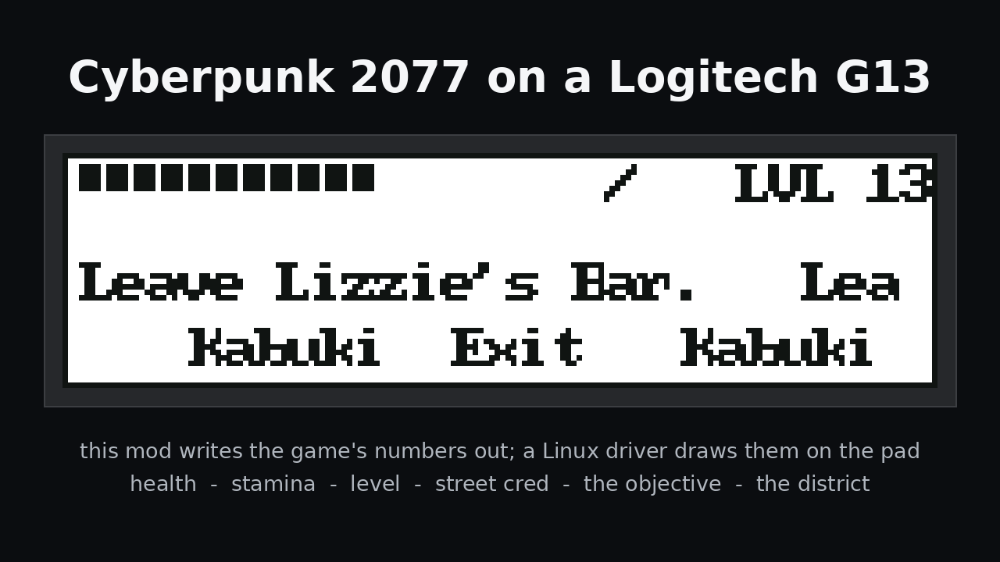

# Cyberpunk 2077 on the pad

The pad can show the game's own numbers while you play  -  health, level, the tracked objective, and
the distance and direction to your map pin. It is two halves sharing one file:

```
the game ──[ this mod, g13-hud ]──▶ <game>/…/mods/g13-hud/hud.json ──[ json: ]──▶ the applet
```

The applet is `cp2077-hud`. It lives in
[logitech-g13-applets](https://github.com/npc-nathan/logitech-g13-applets) with any other extras,
because it is the driver's configuration rather than the game's; the JSON source it is built from is
described in the driver's [Applets and sources](https://github.com/npc-nathan/logitech-g13-linux-driver/blob/main/docs/applets-and-sources.md)
page. This page is the two halves and the order to do them in.

**This repository is the game side.** Nothing installs it for you, no package ships it, and the
driver works exactly the same without it.

## Install it

You need Cyberpunk 2077 with **Cyber Engine Tweaks 1.37 or newer** already installed in it  -  if CET
is not there, the installer says so and stops.

```bash
git clone https://github.com/npc-nathan/g13-hud
cd g13-hud
./install.sh                              # looks in the usual places for the game
./install.sh "/path/to/Cyberpunk 2077"    # or say where it is
```

With a mod manager it is simpler still: install the archive, or its Nexus page, and you are done  -  it
is one Lua file at the path CET loads from. The installer is for people doing it by hand.

It does two things, and it says which:

- copies the mod into `<game>/bin/x64/plugins/cyber_engine_tweaks/mods/g13-hud/`;
- fetches the pad screen from
  [logitech-g13-applets](https://github.com/npc-nathan/logitech-g13-applets) into
  `~/.config/g13/applets/cp2077-hud.json`, with the game's path filled in, and adds it to
  `visuals.json` so the pad can walk to it. With no network the mod still goes in and the message
  says how to add the screen yourself.

Re-running it is how you update. Nothing outside those two places is touched.

## Put it on the pad

Open the window  -  **G13 Configuration** in your applications menu, or `g13 gui`  -  go to the
**Menu** tab, and tick **`on the pad`** for **cp2077-hud**.

The pad then walks to it with **LR**, the same way it walks to any other screen. The numbers move
while the game is running; with the game closed they stay where they were left, because the file is
the only thing the two halves share.



## Take it away

```bash
cd g13-hud
./install.sh --remove
```

That removes the mod and the screen and takes the applet back out of the rotation. It never touches
your game's other mods or your other applets.

## When a number is blank

The mod only writes what the game will answer, and a build that refuses a call leaves the field out
of the file rather than writing a wrong number  -  so a blank on the screen is a reading your game
did not give, not a broken applet. `ammo`, `ammo_total`, `weapon` and the pin are the ones that
differ between builds.

To find out what your build answers, open the CET console in game and run:

```lua
G13Probe()
```

It prints what the game allows for the player, the held weapon, the four stats and the tracked
journal entry. `README.md` says which line in `init.lua` to wire to it.

## Checking it without starting the game

```bash
python3 tests/cet-mod-test.py            # valid Lua, and the right fields from a stub game API
g13 applet check cp2077-hud              # the applet parses and every source it names resolves
g13 applet preview cp2077-hud            # what each of its sources reads right now
```

The first one is what CI runs. The applet's fields are the mod's own file, so with the game closed
`applet preview` shows whatever was written last  -  which is also the easiest way to see which
fields your game is filling in.
